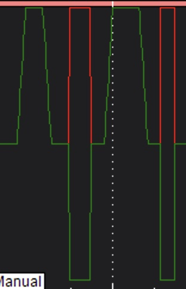

# Improving motor slew for skid steer rovers/boats

# Background

"Motor slew" is the characteristic of a motor where is spins up slowly even when full throttle is applied.  This can be a property of the motor itself or it can be in the speed controller or it can be simulated in software.

ArduPilot Rover has a motor slew parameter [`MOT_SLEWRATE`](https://ardupilot.org/rover/docs/parameters.html#mot-slewrate) to support software simulated motor slew.

## Problem

In Ardupilot Rover motor slew is applied to throttle output but it is possible to configure ArduPilot rover so that motors are also used for steering (skid steering mode).  In this case, the simulated slew is not applied to the motors when it is turning inputs that are causing signals to go to the motors and the motors react very quickly.

### Notes
  * The problem is hidden in auto modes because in those modes the controllers tend to increase all parameters slowly already and fast changes to inputs are unlikely.
  * The problem is pronounced in manual mode becuase a user applying joystick inputs can go full left or full right very easily.

### Evidence
  * https://discuss.ardupilot.org/t/mot-slew-rate-limit-not-properly-applied-to-motor-outputs/98444
  * https://discuss.ardupilot.org/t/slew-rates-on-servo-output/84694/7

## Proposed Solution

Adjust the ArduPilot code to apply `MOT_SLEWRATE` at the motor output rather than at the throttle calculation as it currently is.

### Steps
  * Replicate the problem in simulation
    * Skid-steer rover simulation
  * Adjust ArduPilot Code
     * ArduPilot development environment
       * ~~ArduPilot dev on CodeSpaces~~
       * Run my own build in the simulation
         * ~~Will need a cygwin based dev pipeline for this~~ Got this setup on the dell in the office, it is all a bit of a pain
      *  ~~Find the code in question~~
  * Test in simulation
    * ~~Design the test.~~
    * Run with existing firmware
    * Run with modified firmware
  * Test in real life

## Details

  * `output` is the overall function to output throttle and steering.  It adjusts the throttle value _at this point_ for slew using the helper `slew_limit_throttle` function.
  * `output_skid_steering` is responsible for adding the steering adjustments to the throttle values so that the throttles can give effect to direction change.
  * `get_scaled_throttle` applies the throttle curve if one is defined
  * `get_rate_controlled_throttle` applies the turn rate controller to the skid steer throttle outputs.  This feels like it might substitute for slew but it only works in various auto modes.  You can see that is checked in the code (the adjustment is guarded by `A && _rate_controller.enabled(0)) `)

### Comments

I would like to know the logic for applying the slew limit in a different place to the throttle curve and the turn rate controls.  I think putting slew limit into that pipeline all the way down at `output_throttle` makes more sense.

# Test

  * Make a mission with forward, 180 degree turn, forward, backward.  
  * Arm, run mission in auto.  
  * Swap to manual and run the mission by hand.  Disarm
  * Grab the log and compare the two runs. (download log with MissionPlanner then replay file from MissionPlanner)
  * Make code changes and repeat test.

# Results

With the latest (dev) firmware in Mission Planner simulation, controlled by joystick we get the follwing plot for the two motor servo outputs. Note a digital joystick was used to inputs went from 0 to 100 instantaneously.

The motors have (the red is hidden under the green when the co-incide) incresed quickly, but not immediately for the forward motion but have increased instantaneously for the turns.

There is no motor slew so I wonder what is causing that the slowish increase in forward motor output?

When we add motor slew (set to 10 percent) the results (for a forward motion then two turns) are

Forward motion has increased and decreased very slowly but turns still cause the motors to go from 0 to full instantly.

# Remaining Questions

  * Why do the motor outputs seems to have a minor slew even when there is none set?
  * Why is all this code in `libraries/AR_Motors/AP_MotorsUGV`?  There is nothing else in that folder.  Is AR for ArduRover?

# WIP

`mode.cpp` calculates `throttle_out_limited` using a `g2.motors` function `get_slew_limited_throttle`.  In this function, `_slew_rate` local variable is used to adjust the planned throttle change (`dt`) according to the slew rate.

`AP_MotorsUGV::slew_limit_throttle` also uses this function to calculate the next throttle value.

All of this eventually gets sent to `output_throttle`.  If it goes via standard steering it goes directly (and I assume is based on _throttle).  If it goes via skid steering then the `steering_scaled` is added and this has no motor slew applied, even when `_throttle` has.

The connection between the parameter `MOT_SLEWRATE` and a variable in the code is done by an `AP_GROUPINFO` call in `AP_MotorsUGV.cpp`.  Here it is linked to the `_slew_rate` variable and defaults to `100`.  Here it is called only `SLEWRATE`, I've not found where the `MOT_` gets appended.